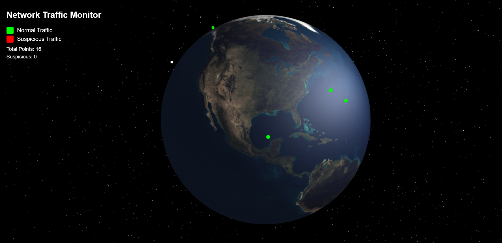
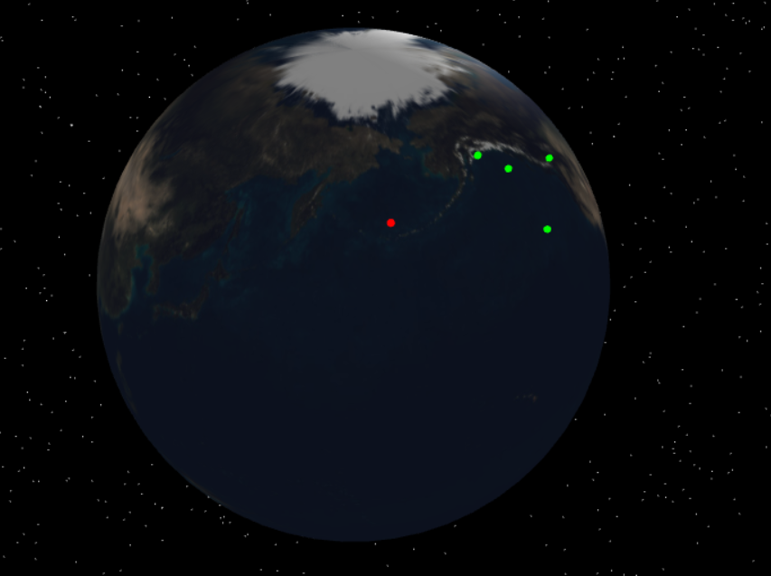
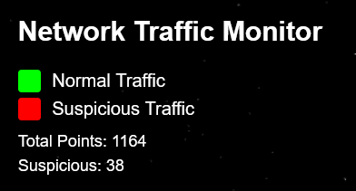

### Time Intervals and Delay in Data Visualization

In this simulation, the time intervals between the data points are calculated based on the timestamps provided in the data. Each timestamp (`Timestamp`) corresponds to the moment when the data was recorded and is used to determine when to display a point on the screen. The delay before showing a point is calculated as the difference between the current time and the time indicated in the timestamp, relative to the start of the simulation. To reduce delays and avoid making points wait too long, the timestamp is multiplied by a coefficient, which speeds up their appearance on the screen. Additionally, to optimize the visualization and prevent screen overload, points that have been on the screen for a long time are removed, keeping the display clean and readable.

### Interactive Features

This project includes several interactive visualization features:

- 🌍 **Globe Zoom and Rotation**  
  Users can rotate and zoom the 3D globe to explore data from different regions.

- ✨ **Sequential Point Appearance and Disappearance**  
  Data points appear in sequence based on timestamp simulation and disappear after some time to avoid clutter.

- 🔴 **Suspicious Activity Highlighting**  
  Suspicious request points are marked in red for quick visual identification.  
  

- 📊 **Real-Time Statistics Calculation**  
  The application tracks and displays statistics on fair vs suspicious requests.  
  

## 🚀 Getting Started

Follow these steps to run the project locally using Docker:

### 🛠 Prerequisites

Make sure you have [Docker](https://www.docker.com/products/docker-desktop) and [Docker Compose](https://docs.docker.com/compose/) installed.

You can check with:

```bash
docker --version
docker compose version
```

### 📦 Clone the Repository

```bash
git clone https://github.com/your-username/your-repo-name.git
cd your-repo-name
```

### 🧱 Build and Start the Project

```bash
docker compose build
docker compose up
```

This will start three services:

- Backend (Flask API) on localhost:5000

- Frontend (3D Globe UI) on localhost:8000

- Sender (data simulator that streams points to the backend)

📌 Open http://localhost:8000 in your browser to view the application.

### ⏹ Stopping the App
When you're done, press Ctrl+C in your terminal and then run:
```bash
docker compose down
```
This will stop and remove all containers.

### 📂 Data Input

Make sure the data/ip_addresses.csv file exists and contains your dataset. This file is mounted into the sender container and drives the simulation.